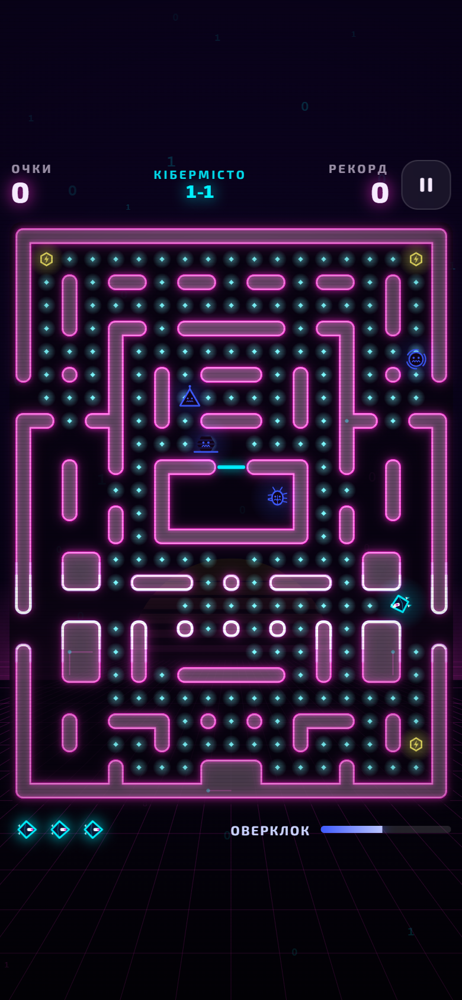
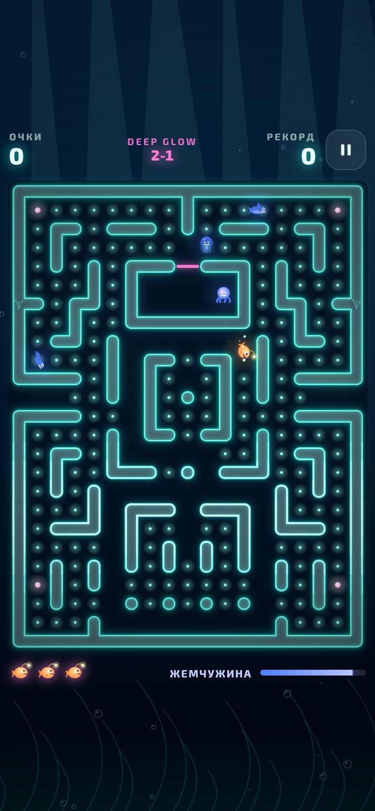
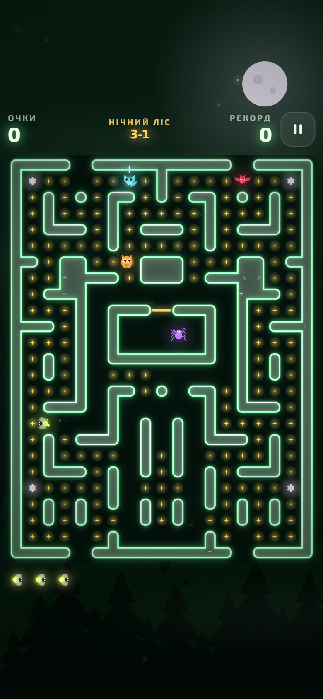

# GLOW RUN

Неонова аркада-лабіринт із трьома світами. Працює в браузері на комп’ютері, Android та iPhone,
встановлюється на телефон як застосунок і запускається без інтернету.

*A neon maze arcade with three worlds. Plain HTML5 Canvas + JavaScript, no frameworks or build step.
Runs in any modern browser on desktop and mobile, installable as a PWA, works offline.*

<p align="center">
  
  
  
</p>

## Особливості

- **Три світи**, у кожного свій лабіринт, герой, вороги, фон, ефекти й музика:
  - **Кібермісто:** дрон-хакер проти антивірусів;
  - **Глибина:** риба-вудильник у глибинах океану;
  - **Нічний ліс:** світлячок у нічному лісі.

  Усі світи відкриті одразу. У кожному 3 рівні, після них гра веде в наступний світ, а після третього вмикається нескінченний режим.
- **Чотири характери ворогів**, у кожного своя поведінка:
  - *Мисливець* іде до героя найкоротшим шляхом (пошук у ширину по клітинках);
  - *Перехоплювач* цілиться туди, де герой опиниться за кілька клітинок;
  - *Патрульний* обходить свою ділянку й робить ривок, якщо бачить героя по прямій;
  - *Хаотик* блукає непередбачувано й залишає пастки, що сповільнюють.
- **Бонуси підряд:** з’їв ворога — у лабіринті з’являється новий бонус.
- **Зручне керування:**
  - рух строго по клітинках;
  - поворот можна натиснути трохи раніше або пізніше, і герой плавно зріже кут;
  - свайпи на телефоні, стрілки та WASD на комп’ютері.
- **Графіка:** неонове сяйво, анімовані персонажі, частинки, спалахи, спливаючі очки, трясіння екрана.
  Усе важке малюється заздалегідь в окремі полотна, тому гра йде плавно й на телефонах.
- **Звук без файлів:** усі ефекти й музика синтезуються через Web Audio.
- **Прогрес зберігається:** рекорд, пройдені рівні в кожному світі, налаштування.

## Як запустити в себе

Потрібен лише Python: він запускає простий локальний сервер.

```bash
python -m http.server 8000
```

Потім відкрийте в браузері `http://localhost:8000`.
Щоб пограти з телефона в тій самій мережі Wi-Fi, відкрийте `http://<IP комп’ютера>:8000`.

## Керування

| | Комп’ютер | Телефон |
|---|---|---|
| Рух | стрілки або WASD | свайп у будь-якому місці екрана |
| Пауза | P або Esc | кнопка ❚❚ |
| Почати / далі | Enter | кнопки на екрані |

## Як влаштований код

```
index.html        сторінка й екрани меню
style.css         оформлення інтерфейсу
sw.js             робота без інтернету (service worker)
manifest.json     встановлення на телефон
src/
  config.js       усі налаштування й баланс: швидкості, таймери, очки
  maze.js         лабіринт із тексту, пошук шляху, тунелі
  entities.js     герой і вороги, рух по клітинках, поведінка ворогів
  game.js         правила: очки, життя, рівні, бонуси, стани гри
  render.js       малювання лабіринту, персонажів і сяйва
  fx.js           частинки, хвилі, спливаючі очки, трясіння
  input.js        клавіатура та свайпи
  audio.js        синтезатор звуків і музики
  ui.js           меню, панелі, картки світів
  storage.js      збереження прогресу
  worlds/         три світи: кольори, карта, вигляд персонажів
prototype/        перша версія на Python (pygame)
```

Лабіринт задається текстом: пишеться ліва половина, а права виходить дзеркально.
Баланс гри змінюється в `src/config.js` без правок решти коду.

## Технології

- HTML5 Canvas 2D;
- JavaScript (ES-модулі);
- CSS: glassmorphism, адаптивна верстка, safe-area для iPhone;
- Web Audio API;
- Service Worker та Web App Manifest.

Без фреймворків і збирачів.
